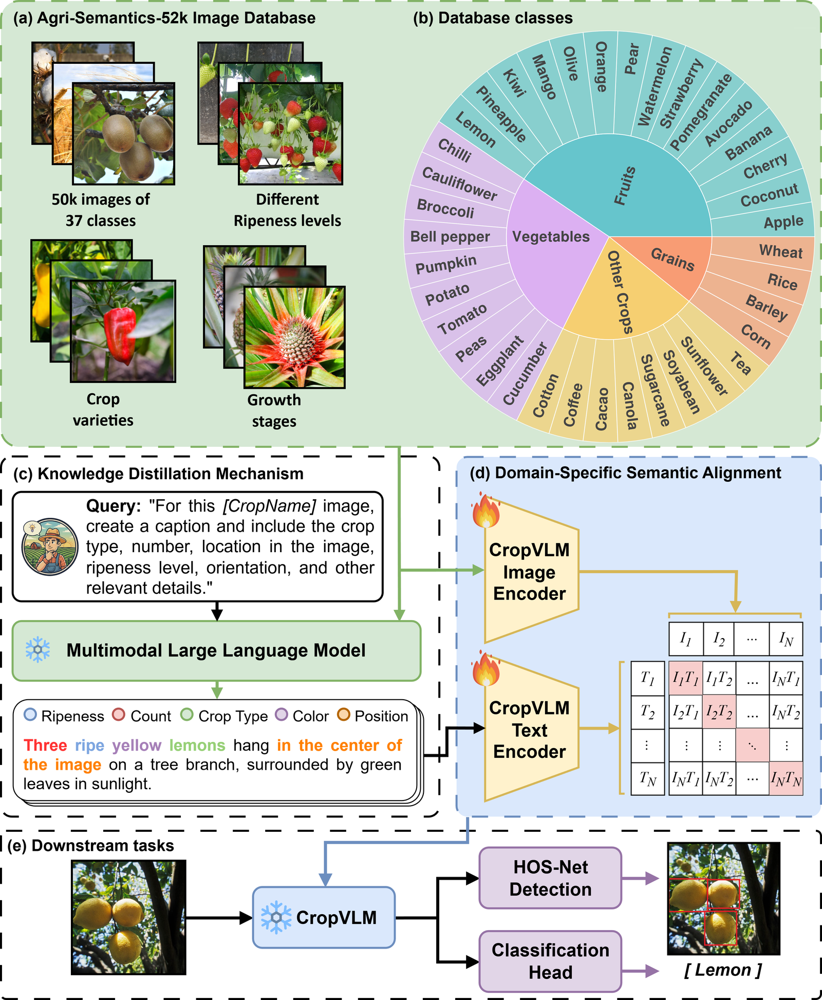
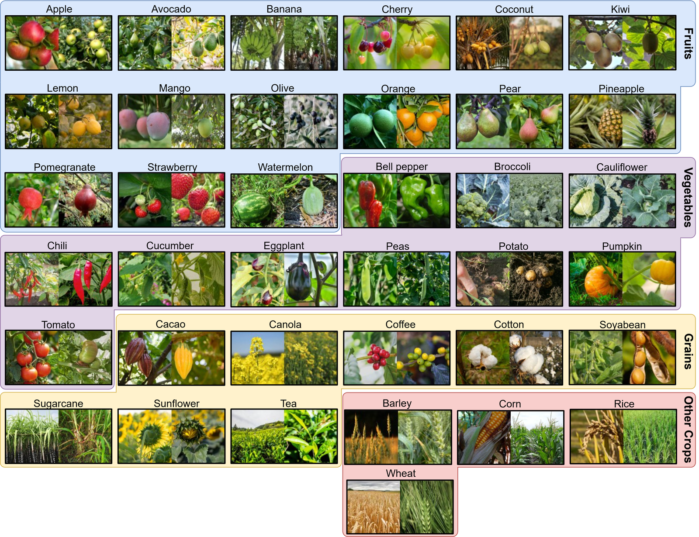
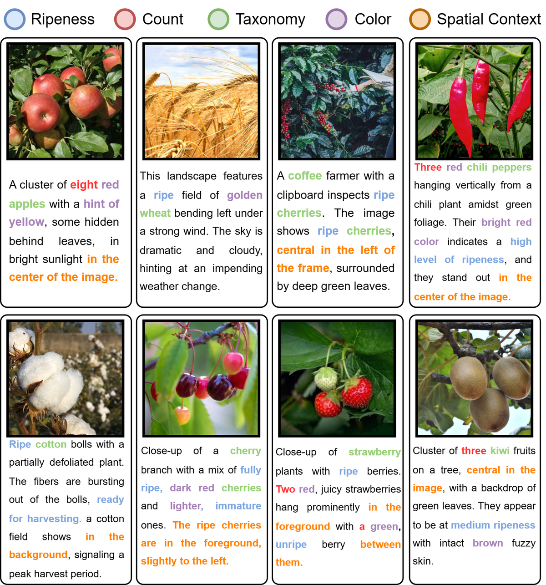

# CropVLM: A Domain-Adapted Vision-Language Model for Open-Set Crop Analysis

CropVLM is a CLIP-based zero-shot image classifier adapted for crop and fruit recognition. It compares one image embedding against text embeddings for candidate class names, then returns the class with the highest cosine similarity.

<p align="center">
  <a href="https://arxiv.org/abs/2605.03259"></a>
  <a href="https://huggingface.co/boudiafA/CropVLM"></a>
</p>



This repository contains:

- a simple CropVLM Python loader,
- a Gradio demo for classifying one image,
- a zero-shot evaluation script for ImageFolder-style datasets,
- five strategically selected high-margin example images in `examples/`.

## Agri-Semantics Data

CropVLM is adapted with dense agricultural image-text supervision. The Agri-Semantics dataset spans 37 crop classes across fruits, vegetables, grains, and industrial crops, with examples covering visual diversity such as ripeness levels, varieties, and growth stages.



The generated captions encode crop identity together with phenotypic cues such as ripeness, count, color, and spatial position.



## Zero-Shot Classification Comparison

We evaluate CropVLM against CLIP-based baselines by encoding each crop class name once, encoding each test image, and assigning the class with the highest cosine similarity in the shared image-text embedding space. The table reports results on the held-out 37-class crop test split.

| Model | Overall Accuracy (%) | Per-Class Mean +/- Std (%) |
|---|---:|---:|
| SigLIP 2 | 3.43 | 3.43 +/- 16.91 |
| AgriCLIP | 4.04 | 4.04 +/- 14.61 |
| RemoteCLIP | 42.52 | 42.52 +/- 27.57 |
| BioCLIP | 48.33 | 48.34 +/- 34.95 |
| BioTrove-CLIP | 51.07 | 51.07 +/- 36.20 |
| BioCLIP 2 | 67.74 | 67.74 +/- 31.17 |
| OpenAI CLIP ViT-B/32 | 70.24 | 70.24 +/- 28.83 |
| **CropVLM** | **72.51** | **72.51 +/- 29.71** |

## Installation

Create an environment and install the dependencies:

```bash
conda create -n cropvlm python=3.10 -y
conda activate cropvlm
pip install -r requirements.txt
```

For GPU inference, install the CUDA build of PyTorch that matches your system before installing the remaining dependencies. For example:

```bash
pip install --index-url https://download.pytorch.org/whl/cu121 torch torchvision
pip install -r requirements.txt
```

## Model

The CropVLM model weights are hosted on Hugging Face: [boudiafA/CropVLM](https://huggingface.co/boudiafA/CropVLM).

Place the checkpoint here:

```text
models/CropVLM.pth
```

The checkpoint is hosted on Hugging Face because it is large:

```python
from huggingface_hub import hf_hub_download

checkpoint = hf_hub_download(
    repo_id="boudiafA/CropVLM",
    filename="models/CropVLM.pth",
)
```

You can also download it manually from [boudiafA/CropVLM](https://huggingface.co/boudiafA/CropVLM) and place it at `models/CropVLM.pth`, or pass any local checkpoint path with `--checkpoint` or `--cropvlm-checkpoint`.

## Gradio Demo

Run:

```bash
python scripts/gradio_demo.py \
  --checkpoint models/CropVLM.pth
```

Then open:

```text
http://127.0.0.1:7860
```

The demo lets you upload any image and edit the candidate class names. The default class list is:

```text
apple, avocado, banana, barley, bell pepper, broccoli, cacao, canola,
cauliflower, cherry, chilli, coconut, coffee, corn, cotton, cucumber,
eggplant, kiwi, lemon, mango, olive, orange, pear, peas, pineapple,
pomegranate, potato, pumpkin, rice, soyabean, strawberry, sugarcane,
sunflower, tea, tomato, watermelon, wheat
```

The included examples are `cacao`, `olive`, `cauliflower`, `sugarcane`, and `sunflower`. They were selected from correct CropVLM predictions with a large cosine-similarity gap between the correct class and the second-best class. The selection details are in `examples/selection_metadata.json`.

## Use CropVLM In Python

```python
from PIL import Image
from cropvlm import load_cropvlm

classifier = load_cropvlm("models/CropVLM.pth")
image = Image.open("examples/cacao.png")

for label, score in classifier.predict(image, top_k=5):
    print(label, score)
```

Use custom candidate labels by passing them to `predict`:

```python
custom_labels = ["cacao", "coffee", "mango", "olive", "sunflower"]

for label, score in classifier.predict(image, labels=custom_labels, top_k=5):
    print(label, score)
```

## Evaluate Zero-Shot Accuracy

The dataset should be arranged like `torchvision.datasets.ImageFolder`:

```text
Crop_Dataset_testing/
  apple/
    image_001.png
  banana/
    image_001.png
  ...
```

Run CropVLM and the supported comparison CLIP models:

```bash
python scripts/evaluate_zero_shot.py \
  --dataset /mnt/e/Desktop/Datasets/FruitDataset/Crop_Dataset_testing \
  --cropvlm-checkpoint models/CropVLM.pth \
  --output outputs/zero_shot_results.json \
  --batch-size 64
```

By default, the script evaluates:

```text
cropvlm
openai_clip_vit_b32
bioclip
bioclip2
biotrove_clip
remoteclip
siglip2
```

You can choose a subset:

```bash
python scripts/evaluate_zero_shot.py \
  --dataset /path/to/test_dataset \
  --models cropvlm openai_clip_vit_b32 bioclip2 \
  --output outputs/subset_results.json
```

The output JSON includes:

- `models`: compact per-model scores,
- `model_results`: full per-model details keyed by model name,
- `results`: full per-model details as a list,
- per-class accuracy,
- per-class accuracy mean and standard deviation,
- confusion matrix,
- optional per-image predictions when `--save-predictions` is used.

The mean and standard deviation are computed across per-class accuracies.

## Notes

- BioCLIP, BioCLIP2, BioTrove-CLIP, RemoteCLIP, and SigLIP2 weights are downloaded automatically by their libraries when first used.
- The score used for classification is cosine similarity between normalized image and text embeddings.
